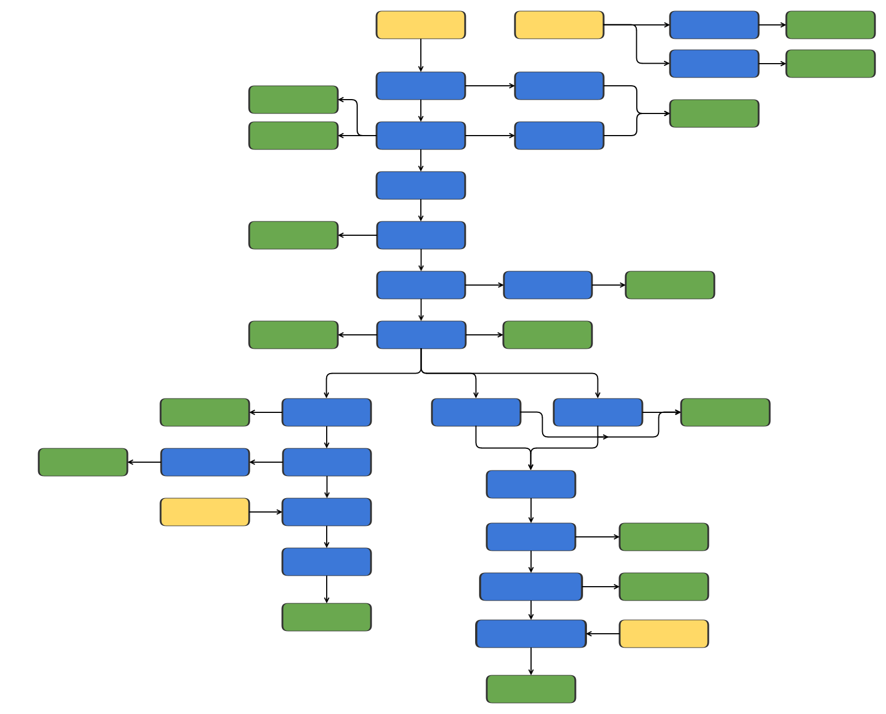

# Tp RNAseq

[](https://www.nextflow.io/)
[](https://www.docker.com/)
[](https://sylabs.io/docs/)

## Introduction

**Tp RNAseq** is a pipeline for quantifying RNAseq reads that map to features of a bacterial genome using [Bowtie2](https://bowtie-bio.sourceforge.net/bowtie2/index.shtml) and [HTSeq](https://htseq.readthedocs.io). It has been adapted for use with *Treponema pallidum*, but could also in principle be used to analyse data for other bacterial species.

The pipeline can be run on local machines and high-performance computing (HPC) clusters with minimal setup.

## Pipeline summary



In its simplest usage, **Tp RNAseq** takes a sample manifest (CSV; see [Generating a manifest](#generating-a-manifest)), reference (fasta) and annotation (gff) as input. It then runs the following steps on `.fastq.gz` files provided in the sample manifest:

1. **Data combining**: `.fastq.gz` files are combined based on sample or replicate structure.
2. **Basic QC**: Adaptor removal and trimming of poor quality bases is performed by `fastp`. Quality is assessed with `FASTQC` pre- and post-fastp.
3. **Mapping**: Reads are mapped to the given reference genome using `Bowtie2`. Bowtie2 index files are created if necessary.
4. **Duplicate removal** (optional): Duplicate reads are removed using Picard's [MarkDuplicates](https://gatk.broadinstitute.org/hc/en-us/articles/360037052812-MarkDuplicates-Picard).
5. **Read filtering**: Aligned reads are filtered with a user-defined filter (keeping all properly mapped read pairs by default). Additional filters are applied to generate strand-specific BAM files.
6. **Read quantification per feature**: Performed on the user-defined filtered BAM by `htseq-count`. The generated count tables are combined across samples to generate a summary count table for convenient downstream analysis.
7. **Coverage analysis**: Performed by `bedtools` and custom scripts on the strand-specific BAM files. Coverage plots will be generated per gene and intergenic region from the given annotation file (gff).

`FASTQC`, `samtools stats` and statistics from `fastp` and `picard` are collected and displayed in a convenient `html` report using [multiQC](https://multiqc.info/).

The pipeline allows users to keep various intermediate files along the way. See [Usage](#usage) and [Output](#output) for more details.

## Requirements

### Software

- A Unix-like operating system environment (e.g. Linux, macOS, Windows with [WSL](https://en.wikipedia.org/wiki/Windows_Subsystem_for_Linux)) with Bash 3.2 or later.
- Java 11 or later ([OpenJDK](https://openjdk.org/)) as a nextflow dependency
- [nextflow](https://www.nextflow.io/) as workflow management system
- [Docker](https://www.docker.com/), [Singularity](https://sylabs.io/singularity/)/[Apptainer](https://apptainer.org/), or [conda]() for pipeline dependency management

### Hardware (recommended)

- \>= 16GB RAM
- \>= 2 CPUs/cores
- Enough space for images (< 10GB) and intermediate data

## Dependency Installation
- **Linux / macOS**
    - Install [Java and Nextflow](https://www.nextflow.io/docs/latest/install.html)
    - Install any of:
        - [Docker Desktop](https://docs.docker.com/desktop/install) (recommended)
        - [Docker Engine](https://docs.docker.com/engine/install)
        - [Singularity](https://docs.sylabs.io/guides/latest/user-guide/quick_start.html)
        - [Apptainer](https://apptainer.org/)
        - [miniconda3](https://docs.anaconda.com/free/miniconda/)

- **Windows (with WSL)**
    - Install [WSL](https://learn.microsoft.com/en-us/windows/wsl/install) by Microsoft
    - Install [Java and Nextflow](https://www.nextflow.io/docs/latest/install.html)
    - Install any of:
        - [Docker Desktop with WSL integration](https://docs.docker.com/desktop/wsl/)
        - [miniconda3](https://docs.anaconda.com/free/miniconda/)

- Troubleshooting:
    - After installation of Java, you may need to `export JAVA_ARG=$(which java)` to ensure successful nextflow installation.
    - Docker will usually require administrator privileges, so you may have to seek approval if using a managed machine (better to use `conda` in this case).
    - After installation of Docker Desktop on macOS, you might need to [allow Docker to access more system resources](https://docs.docker.com/desktop/settings/mac/), especially CPU and Memory, to match pipeline hardware requirements.

## Getting started

### Running on a personal computer

1.  [Install the necessary dependencies](#dependency-installation)

2.  Open a terminal.

3.  Run the pipeline:  
    For example input, please see [Generating a manifest](#generating-a-manifest).
    
    To run the pipeline with `docker`, use the `-profile docker` option:
    ```
    nextflow run sanger-pathogens/TpRNAseq \
        -profile docker \
        --manifest test_data/manifest.csv \
        --reference test_data/ref.fasta \
        --annotation test_data/ref.gff \
        --library_strandedness reverse
    ```

    Other profiles are also supported (`docker`, `conda`, `singularity`, `apptainer`).  
    :warning: If no profile is specified the pipeline will run with a Sanger HPC-specific configuration.

    See [usage](#usage) for all available pipeline options.

### Running on the farm (Sanger HPC clusters)

1.  Load nextflow and singularity modules:
    ```bash
    module load nextflow ISG/singularity
    ```

2.  Clone the repo and change directory into it.

3.  Start the pipeline:  
    For example input, please see [Generating a manifest](#generating-a-manifest).

    Example:
    ```bash
    nextflow run main.nf --manifest test_data/manifest.csv --reference test_data/ref.fasta --annotation test_data/ref.gff --library_strandedness reverse
    ```

    It is good practice to submit a dedicated job for the nextflow master process (use the `oversubscribed` queue):
    ```bash
    bsub -o output.o -e error.e -q oversubscribed -R "select[mem>4000] rusage[mem=4000]" -M4000 \
        nextflow run main.nf --manifest test_data/manifest.csv --reference test_data/ref.fasta --annotation test_data/ref.gff --library_strandedness reverse
    ```

    See [usage](#usage) for all available pipeline options.

4.  Once your run has finished, check output in the directory supplied to the `--outdir` option (default `./results`). Remember to clean up any intermediate files. To do this (assuming no other pipelines are running from the current working directory) run:

    ```bash
    rm -rf work .nextflow*
    ```

    Alternatively, use [`nextflow clean`](https://www.nextflow.io/docs/latest/cli.html#clean), which allows selective removal of these files.

### Running on any other HPC cluster

This pipeline should be compatible with most HPC clusters, but will not have the necessary configuration files for those clusters hosted in this repository.

Nevertheless, your insitution may support an [nf-core configuration profile](https://github.com/nf-core/configs/tree/master/conf). Documentation for the use of these profiles can be found [here](https://github.com/nf-core/configs?tab=readme-ov-file#documentation).

These profiles are supported out-of-the-box by this pipeline. You simply have to run the pipeline with the relevant profile. For example, to run the pipeline on the Cambridge HPC, run with `-profile cambridge`.

:warning: If no profile is specified the pipeline will run with a Sanger HPC-specific configuration. 


## Managing image dependencies and running offline

With some profiles, namely `singularity` or `apptainer`, environment variables (`NXF_SINGULARITY_CACHEDIR` and `NXF_APPTAINER_CACHEDIR`) should be set to a directory path where a cache of images should be stored. See [here](https://www.nextflow.io/docs/latest/config.html#environment-variables) for more information on nextflow environment variables and [here](https://www.nextflow.io/docs/stable/container.html) for more information on how nextflow manages container dependencies. These variables should be set in a config file, e.g. `~/.bashrc`, to allow the reuse of images in the cache (and avoid the pipeline downloading them whenever it is run in a new directory).

Should you need to run the pipeline offline, it is best to make use of pre-populated dependency caches. These can be created with any of the supported profiles (e.g. `-profile docker` or `-profile conda`) and involves running the pipeline once to completion with all the options that would be required for offline usage.

Additionally, the pipeline makes use of configuration files that are pulled from online sources. To avoid a dependence on these, you must download the configuration files in advance and specify their local paths using `--nf_core_custom_config` and `--generic_config`.

nf-core also provides [`nf-core download`](https://github.com/nf-core/tools?tab=readme-ov-file#downloading-pipelines-for-offline-use) tool that allows you to easily download pipelines and singularity images for offline use. To use this, you will have to first [install the `nf-core` tool](https://github.com/nf-core/tools?tab=readme-ov-file#installation). 


## Generating a manifest

Manifests supplied as an argument to `--manifest`, should be of of the following format:

```console
ID,REP,R1,R2
sample,1,./test_data/inputs/sample_rep1_1.fastq.gz,./test_data/inputs/sample_rep2_2.fastq.gz
sample,2,./test_data/inputs/sample_rep2_1.fastq.gz,./test_data/inputs/sample_rep2_2.fastq.gz
```

Where column `ID` can be an arbitrary sample identifier, `REP` describes the replicate structure of the data, `R1` is a .fastq.gz file of forward reads, `R2` is the mate .fastq.gz file containing reverse reads. The above example shows entries for two replicates of one sample.

## Usage

Pipeline-specific options are outlined in the help message below. Run the pipeline with `--help` to view this.

There are also a number of `nextflow`-specific options, which start with a single `-`. A summary of these options can be found at https://www.nextflow.io/docs/latest/cli.html and viewed on the command line by running `nextflow -h`. Of these, the most useful are probably:
- `-resume`: to run the pipeline again while making use of data that has been generated previously (saving computation time and resources).
- `-r <tag/branch/revision_number>`: to run a specific version of this pipeline to ensure reproducible/comparable results. 

```console
---------------------------------------------------------------------------------------


88888888888            8888888b.  888b    888        d8888                           
    888                888   Y88b 8888b   888       d88888                           
    888                888    888 88888b  888      d88P888                           
    888  88888b.       888   d88P 888Y88b 888     d88P 888 .d8888b   .d88b.   .d88888
    888  888 "88b      8888888P"  888 Y88b888    d88P  888 88K      d8P  Y8b d88" 888
    888  888  888      888 T88b   888  Y88888   d88P   888 "Y8888b. 88888888 888  888
    888  888 d88P      888  T88b  888   Y8888  d8888888888      X88 Y8b.     Y88b 888
    888  88888P"       888   T88b 888    Y888 d88P     888  88888P'  "Y8888   "Y88888
         888                                                                      888
         888                                                                      888
         888                                                                      888
                              ____          ,--r ~.       ,^"   `"w                   
               ____        x^      'w     |L.._    ^m    A^''w     V                  
              D    "W     [R``'w    '@   ,R   [.    [L  jR    K     K     m" ` `W     
             A0     [H    R    [H    [   R     0     @  R     [     [L   0      R     
            ["[L     0   R     [@     @ R      RH    [ A       K     W  A      A      
           #"  [      K,R     /L[     0R     ,R D    [R       #0     [ #      #       
         y^    ,%     '@    ,R   L    [     z"  [    [H      A [L     R      A       
          `  "   T_    'W ,^     0    [L_,.#     L   [H    zC   0     @     R         
                  ^~-.. <^        %_     ,4`     T,   " ^"x"    !L    0__.gR         
                                    ``" `          "----^"        Y.____x^"           
---------------------------------------------------------------------------------------

Typical pipeline command:

  nextflow run main.nf --manifest <manifest> --annotation <gff> --reference <fasta> --library_strandedness [reverse] --outdir [./results]

Input Options
  --manifest                      [string]  Path to a CSV manifest comprising 4 columns (ID, REP, R1, R2). ID is an arbitrary sample ID, REP describes replicate 
                                            structure, R1 and R2 columns contain paths to *.fastq.gz files. 
  --reference                     [string]  null
  --annotation                    [string]  Path to genome annotation in GFF format.
  --library_strandedness          [string]  Strandedness of the RNAseq library. Options: reverse, forward, none. (accepted: reverse, forward, none)

Output Options
  --outdir                        [string]  The output directory where the results will be saved. [default: ./results]
  --keep_combined_fastqs          [boolean] Keep the combined fastqs.
  --keep_trimmed_fastqs           [boolean] Keep the trimmed fastqs.
  --keep_sorted_bam               [boolean] Keep the sorted bam files generated from mapping.
  --keep_dedup_bam                [boolean] Keep the deduplicated bam files.
  --keep_filtered_bam             [boolean] Keep filtered bam files.

Data Combining Options
  --combine_fastqs                [boolean] Combine fastqs at replicate level, based on the replicate structure described in the manifest.
  --combine_rep                   [boolean] Combine fastqs at sample level, based on sample identifiers provided in the manifest.

QC Options
  --skip_trim                     [boolean] Skip trimming.
  --trimmer                       [string]  Software to use for trimming. (accepted: fastp) [default: fastp]
  --fastp_args                    [string]  Options and arguments that will be supplied to fastp to modify QC behaviour.
  --dedup                         [boolean] Remove duplicates (hopefully library prep artifacts) from bam file post-mapping.

Mapping Options
  --bowtie2_args                  [string]  Options and arguments that will be supplied to Bowtie2 to modify mapping behaviour. [default: --local 
                                            --very-sensitive-local --rdg 8,4 --rfg 8,4 --no-mixed] 

Counting Options
  --htseq_args                    [string]  Options and arguments that will be supplied to htseq-count to modify counting behaviour. [default: --type gene 
                                            --idattr locus_tag --nonunique none --secondary-alignments ignore] 
  --samtools_filter_args          [string]  Arguments supplied to samtools to will be used to filter alignments of interest for counting. [default: -f 
                                            2] 
  --annotate_feature_assignment   [boolean] Generate an annotated bam file where each read is assigned to the feature for which is has been counted.

Coverage Options
  --strand_specific               [boolean] Run strand-specific coverage analysis.
  --pairwise                      [boolean] Generate pairwise sample comparison coverage plots.
  --coverage_window_size          [integer] Size of window or step over which to compute cumulative per base coverage (output as a wig file). [default: 
                                            100] 
  --coverage_context              [integer] Size of context around the annotated region (coverage_window_size base pairs either side) in the coverage plot. 
                                            [default: 100] 

Resource Request Options
  --max_cpus                      [integer] Maximum number of CPUs that can be requested for any single job. [default: 256]
  --max_memory                    [string]  Maximum amount of memory that can be requested for any single job. [default: 2.9 TB]
  --max_time                      [string]  Maximum amount of time that can be requested for any single job. [default: 30d]
  --max_retries                   [integer] Maximum number of retries before ingnoring process failure. [default: 2]
  --retry_strategy                [string]  Default retry strategy (used in the event that software fails to process data for an unexpected reason) 
                                            [default: ignore] 
  --submit_rate_limit             [string]  LSF-specific: Change the rate at which the pipeline will submit jobs on the cluster.
  --queue_size                    [string]  LSF-specific: Maximum number of jobs pipeline will submit jobs on the cluster at any given time.

Generic options
  --help                          [boolean] Display help text.
  --monochrome_logs               [boolean] Do not use coloured log outputs.
  --multiqc_config                [string]  Custom config file to supply to MultiQC.
  --tracedir                      [string]  Directory in which to save pipeline reporting information. [default: ./results/pipeline_info]

Config Inheritance Options
  --generic_config_base           [string]  Inherit configuration from a base URL. [default: 
                                            https://raw.githubusercontent.com/sanger-pathogens/nextflow-commons/] 
  --generic_config_version        [string]  Specify the version to inherit (will be appended to base URL). [default: master]
  --generic_config                [string]  Override the above with a generic config URL (or file path).
  --nf_core_custom_config_base    [string]  nf-core configuration base URL. [default: https://raw.githubusercontent.com/nf-core/configs/]
  --nf_core_custom_config_version [string]  Specify the version of nf-core configs to inherit (will be appended to base URL). [default: master]
  --nf_core_custom_config         [string]  Override the above with an nf-core config URL (or file path).
  --input                         [string]  Ignore: Parameter inherited but not used by this pipeline.

------------------------------------------------------
```

## Output

The pipeline will generate a directory structure in the output directory specified by `--outdir`. Some directories may be missing depending on the data retention flags employed (See [Usage](#usage)). Note that parameter values are represented by `{param_name}` below.
```
results/
├── bowtie2_index
├── coverage
│   ├── plots
│   ├── wig_{coverage_window_size}
│   └── wig_raw
├── fastp
│   └── fastqc
│   │   ├── raw
│   │   └── trim
│   └── reports
├── picard
│   └── metrics
├── filtered_bams
│   ├── minus_filter
│   ├── plus_filter
│   └── user_defined_filter
├── htseq
├── multiqc
│   ├── multiqc_report_data
│   ├── multiqc_report_plots
│   └── multiqc_report.html
├── pipeline_info
├── qc
│   └── samtools_stats
├── sorted_bams
└── ref_index
```

The content of these folders is described in more detail below. Note that output files will be sample-specific if `--combine_rep` is used and replicate-specific otherwise:
| Directory / File | Description |
| --- | ---|
| `bowtie2_index` | Contains Bowtie2 index files (`.bt2.*`) for the given reference (`--reference`). |
| `coverage/plots` | Contains per sample (or pairwise-sample if `--pairwise`) folders, containing strand-specific coverage plots for all `gene` level annotations in the given `--gff` and intergenic regions. |
| `coverage/wig_{coverage_window_size}` | Contains `*.wig` files which summarize cumulative (per base) genome coverage over steps of the given `--coverage_window_size`. |
| `coverage/wig_raw` | Contains `*.wig` files per base genome coverage. |
| `fastp/trimmed_fastqs` | Contains trimmed reads in `*.fastq.gz` files.<br> Generated with `--keep_trimmed_fastqs` and if not `--skip_trim`. |
| `fastp/reports` | Contains fastp report files in `html` and `json` format. |
| `fastp/fastqc` | Contains FASTQC data and reports for both trimmed and raw `*.fastq.gz` files. |
| `picard` | Contains deduplicated BAM files.<br> Generated with `--keep_dedup_bam`. |
| `picard/metrics` | Contains deduplication metrics files generated by `picard`. |
| `filtered_bams/(plus\|minus)_filter` | Contains reverse (`plus_filter`) and forward (`minus_filter`) strand-specific BAM files, containing reads that mapped to each strand of the given `--reference`.<br> Generated with `--keep_filter_bam`. |
| `filtered_bams/user_defined_filter` | Contains BAM files, containing reads that mapped to the given `--reference` and filtered using `--samtools_filter_args`.<br> Generated with `--keep_filter_bam`. |
| `htseq` | Contains HTSeq-generated count data (`tsv` format) suitable for differential expression analysis. It also contains a summary across all samples `gene_counts.tsv`. |
| `multiqc` | Contains a summary of all interesting QC metrics/statistics generated by the pipeline. |
| `sorted_bams` | Contains raw sorted BAM files (prior to filtering).<br> Generated with `--keep_sorted_bam`. |
| `qc/samtools_stats` | Contains statistics on mapped and filtered reads. |
| `ref_index` | Contains a copy of the reference `fasta` and fasta index `*.fai`.<br> Generated only if a reference `*.fai` could not be detected in the same directory as the input reference. |
| `pipeline_info` | Contains an execution report (`html`), execution trace (`tsv`) - useful for identifying failed processes, and a pipeline flowchart (`svg`). |


## Credits

**Tp RNAseq** was produced by PAM informatics at the Wellcome Sanger Institute, in collaboration with Linda Grillova and Eli Carrami. Inspiration was taken, in places, from the [nf-core pipelines](https://nf-co.re/pipelines).

## Support

If you require any help running this pipeline, experience a bug, or would like to request a new feature, please post an issue.

## Citations

This pipeline was developed to support the work of the following publications. If you use this pipeline in your work, please cite as appropriate:

<TODO - List of citations>

An extensive list of references for the tools used by the pipeline can be found in the [`CITATIONS.md`](CITATIONS.md) file.
